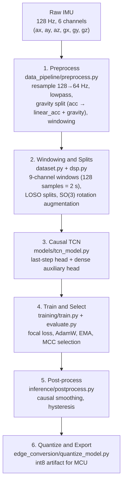

# HopeGait

[](https://www.python.org/)
[](https://pytorch.org/)
[](https://ai.google.dev/edge/litert)
[](tests/)

Real-time Freezing of Gait (FoG) detection from wearable IMU data using a causal TCN, targeting edge deployment on microcontrollers.

FoG — sudden gait arrest mid-step — is a hallmark Parkinson's symptom and a primary fall risk. This project trains a low-latency on-device classifier so cueing systems can intervene in real time.

> **Scope disclaimer:** Student research project. Not a medical device. Not clinically validated. Do not use for safety-critical clinical decisions.

---

## Table of Contents

1. [System Architecture](#1-system-architecture)
2. [Problem Setup](#2-problem-setup)
3. [Modeling and Training](#3-modeling-and-training)
4. [Data Pipeline and Leakage Controls](#4-data-pipeline-and-leakage-controls)
5. [Inference and Post-processing](#5-inference-and-post-processing)
6. [Repository Layout](#6-repository-layout)
7. [Dataset Setup](#7-dataset-setup)
8. [Installation and Quick Start](#8-installation-and-quick-start)
9. [Cloud and Docker Runs](#9-cloud-and-docker-runs)
10. [Evaluation and Tests](#10-evaluation-and-tests)
11. [Next Steps](#11-next-steps)
12. [References](#12-references)
13. [Data and Credit](#data-and-credit)
14. [License](#license)

---

## 1. System Architecture

End-to-end pipeline from raw IMU samples to a quantized model artifact ready for microcontroller deployment.



Each downstream stage is causal — outputs at time `t` depend only on samples up to `t`, so the offline training graph mirrors the live streaming graph on-device.

---

## 2. Problem Setup

| | |
|---|---|
| **Raw input** | 6 channels @ 128 Hz from a lumbar IMU: `ax, ay, az` accelerometer (m/s²) and `gx, gy, gz` gyroscope (rad/s). Matches upstream [Stanford NMBL dataset](https://github.com/stanfordnmbl/imu-fog-detection) (`FREQ_SAMPLED = 128`). |
| **Preprocess** | Resample 128 → 64 Hz (`FREQ_DESIRED`); 15 Hz anti-alias lowpass; 0.3 Hz split of `acc` into `gravity` and `linear_acc = acc − gravity`. 6 raw → **9 model channels**. |
| **Model input** | 9 channels per timestep: `linear_acc xyz` (m/s², gravity-removed) + `gravity xyz` (m/s², low-frequency acc) + `gyro xyz` (rad/s). 2-second window = 128 samples @ 64 Hz. |
| **Output** | Per-window FoG probability → post-processed binary decision for cueing logic |
| **Phase 1 — Brain** | Train causal TCN with leave-one-subject-out (LOSO) cross-validation |
| **Phase 2 — Edge** | Compress and export model artifacts for microcontroller-class deployment |

The 6 → 9 expansion is a deterministic DSP split, not augmentation. A 4th-order Butterworth lowpass at 0.3 Hz separates the near-DC gravity component from accelerometer motion: `gravity = lowpass(acc, 0.3 Hz)`, `linear_acc = acc − gravity`. Feeding both to the network is an inductive bias — `gravity` encodes orientation, `linear_acc` encodes gait dynamics — so the network doesn't have to learn the split internally. No information is added; the 3 gravity channels are fully determined by the 3 accel channels.

---

## 3. Modeling and Training

### 3.1 Why a causal TCN

A causal Temporal Convolutional Network is a strong fit for streaming IMU classification:

| Property | Detail |
|---|---|
| Receptive field | 61 samples ≈ 0.95 s @ 64 Hz — 4 blocks, channel progression `(32, 64, 96, 128)`, exponential dilations `1/2/4/8` |
| Causality | Output at step `t` never depends on future samples |
| Deployment fit | Viable for streaming inference and MCU export |

The backbone is augmented with three streaming-friendly building blocks:

- **Per-timestep Layer Normalization** — replaces BatchNorm so the network is strictly causal and behaves identically at batch size 1 (live inference) and during post-training int8 quantization.
- **Causal Squeeze-and-Excitation Networks** — channel reweighting using a *cumulative* mean across time, so the dense head stays causal.
- **Deep Networks with Stochastic Depth** on residual branches — regularizes the deep stack without adding inference cost.

### 3.2 Heads and losses

| Head | Role |
|---|---|
| Last-step head | Real-time deployment inference |
| Dense per-timestep head | Auxiliary training supervision — stronger gradient signal |

Both heads use Focal Loss for Dense Object Detection to handle class imbalance. Total loss = last-step loss + (`dense_loss_weight` × dense loss). `dense_loss_weight` is set in `config.py`.

### 3.3 Optimization

| Setting | Value |
|---|---|
| Optimizer | Decoupled Weight Decay Regularization (AdamW)
| Mixed precision | Enabled on CUDA (optional) |
| EMA shadow weights | EMA copy of weights used for validation and checkpoint selection |
| Best epoch criterion | Matthews Correlation Coefficient (MCC) on inner validation subject |

---

## 4. Data Pipeline and Leakage Controls

### Leakage prevention

| Control | Implementation |
|---|---|
| LOSO splitting | Strict split by true subject identity |
| Inner validation | Subject selected from training pool only — never from test fold |
| Threshold selection | Youden-J on inner validation split, frozen before test fold |
| Scaler | `RobustScaler` fit on training data only; serialized for inference |

### Bug fixes integrated

| Fix | Detail |
|---|---|
| Freeze Index correction | PSD computed per axis then summed — prevents magnitude-rectification frequency doubling |
| Filter startup transients | Removed via `lfilter_zi` warm starts |
| Same-subject split leakage | Fixed by grouping recordings under the same person ID |

---

## 5. Inference and Post-processing

| Stage | Operation |
|---|---|
| 1 — Smoothing | Causal moving average over recent classifier probabilities |
| 2 — Decision | Schmitt-trigger hysteresis around fold-specific threshold |

Eliminates near-threshold flicker that would otherwise produce unstable cueing behavior.

---

## 6. Repository Layout

```
HopeGait-FoG_Detection_via_IMU_and_ML/
├── Dockerfile
├── README.md
├── DATA_LICENSE              # Upstream Stanford NMBL license (BSD-3)
├── pyproject.toml            # Packaging + requires-python (>=3.11)
├── requirements.txt          # Training deps
├── requirements-edge.txt     # Edge conversion deps (install separately)
├── config/
│   └── training_config.yaml  # Editable hyperparameter overrides (optional)
├── data/
│   ├── raw/                  # Raw 128 Hz IMU (not redistributed)
│   └── processed/win_<W>/    # Bundled preprocessed windows
├── models/                   # Edge artifacts; checkpoints under models/win_<W>/
├── notebooks/                # Exploratory notebooks
├── reports/                  # EDA + LOSO results tables
├── scripts/
│   ├── launch_cloud.sh
│   ├── smoke_train.py
│   └── eda.py
├── src/
│   ├── config.py
│   ├── main.py
│   ├── data_pipeline/
│   │   ├── dataset.py
│   │   ├── dsp.py
│   │   └── preprocess.py
│   ├── models/
│   │   ├── tcn_model.py
│   │   └── focal_loss.py
│   ├── training/
│   │   ├── train.py
│   │   ├── evaluate.py
│   │   └── ema.py
│   ├── inference/
│   │   └── postprocess.py
│   ├── baselines/
│   │   └── freeze_index_baseline.py
│   └── edge_conversion/
│       ├── quantize_model.py
│       └── evaluate_tflite.py
├── tests/                    # pytest suite (dataset, dsp, model, eval, edge, baselines)
└── .github/workflows/        # CI: tests, training launch
    ├── ci.yml
    └── train.yml
```

---

## 7. Dataset Setup

Data source: [Stanford NMBL IMU FoG Detection Repository](https://github.com/stanfordnmbl/imu-fog-detection).

**Step 1 — Clone the Stanford dataset:**

```bash
git clone https://github.com/stanfordnmbl/imu-fog-detection.git
```

**Step 2 — Place raw files (flat) under `data/raw/`:**

```
data/
└── raw/
    ├── pt1_visit_24_tbc_walklr_0_trial_2.xlsx
    ├── pt1_visit_34_tbc_walklr_1_trial_1.xlsx
    ├── pt2_visit_25_tbc_walklr_1_trial_1.xlsx
    └── ...                # one .xlsx (or .csv) per walking trial
```

Filenames follow `pt<N>_visit_<V>_tbc_walklr_<dir>_trial_<T>`, but **subject identity comes from the `subject_ID` column, not the filename** — so the LOSO split never leaks a subject across folds. Files may sit flat in `data/raw/` (as shipped) or in per-subject subfolders; preprocessing globs recursively.

Each recording holds **128 Hz** samples across many body IMUs (chest, lumbar, ankles, feet, head, thighs, wrists — 69 columns). The pipeline reads **only the lumbar sensor** — `imu_lumbar_{ax,ay,az}` (m/s²) + `imu_lumbar_{gx,gy,gz}` (rad/s) — plus `time`, `subject_ID`, and binary `freeze_label`. Preprocessing resamples to 64 Hz and expands the 3 accel channels into `linear_acc + gravity`, so the model sees 9 channels per timestep. Bundled set: ~59 recordings, 7 subjects, ~25.7% FoG.

**Step 3 — Verify placement before running:**

```bash
ls data/raw/        # expect *.xlsx recordings
```

> Use of raw data is subject to Stanford NMBL's original license and terms. See their repo for details.

---

## 8. Installation and Quick Start

### Requirements

- Python 3.11+
- CUDA-capable GPU recommended for full LOSO training (CPU works for smoke tests)

### Local setup (recommended)

```bash
# 1. Clone
git clone https://github.com/truong-tt/parkinson-fog-device.git
cd parkinson-fog-device

# 2. Create and activate virtual environment
python3.11 -m venv .venv
source .venv/bin/activate          # Windows: .venv\Scripts\activate

# 3. Install PyTorch with the correct CUDA wheel FIRST
# CUDA 12.1 (most cloud GPU boxes):
pip install torch --index-url https://download.pytorch.org/whl/cu121
# CUDA 11.8:
# pip install torch --index-url https://download.pytorch.org/whl/cu118
# CPU only (CI / smoke tests):
# pip install torch --index-url https://download.pytorch.org/whl/cpu

# 4. Install remaining training dependencies
pip install -r requirements.txt

# 5. Set PYTHONPATH (required for local runs — src/ is the package root)
export PYTHONPATH=$(pwd)/src      # Windows: set PYTHONPATH=%cd%\src

# 6. (Optional) Copy and edit the YAML config template
#    config/training_config.yaml ships with the in-code defaults; edit it
#    to override hyperparameters without touching code. Env vars
#    (HOPEGAIT_*) override YAML, YAML overrides in-code defaults.

# 7. Place dataset (see Section 7), then run
python src/main.py
```

> **Why install PyTorch first?** `requirements.txt` pins `torch>=2.0` without a wheel URL. Installing PyTorch separately with the correct CUDA index prevents pip from pulling the CPU wheel and silently breaking GPU training.

### CLI flags

```bash
# Skip training, run evaluation only
python src/main.py --skip-train

# Skip both training and evaluation (pipeline dry-run)
python src/main.py --skip-train --skip-eval

# Force re-run of preprocessing even if cache exists
python src/main.py --force-preprocess
```

### Edge conversion (optional)

Only needed when running `edge_conversion/quantize_model.py`. Install in a *separate* environment from training (protobuf/TF pins conflict with the PyTorch stack):

```bash
pip install -r requirements-edge.txt
```

Includes `ai-edge-torch>=0.2.0` (primary path) and the legacy ONNX/TF stack (`tensorflow==2.15.0`, `onnx>=1.15`, `onnx-tf>=1.10`, `protobuf>=3.20.3,<5`). Both targets produce int8 TFLite using the integer-arithmetic-only quantization scheme of [Quantization and Training of Neural Networks for Efficient Integer-Arithmetic-Only Inference](https://arxiv.org/abs/1712.05877).

After a fold has been trained (so `models/win_<window>/hopegait_tcn_best_subj<id>.pth` exists), run the integrated edge step:

```bash
# Direct invocation
python src/edge_conversion/quantize_model.py --subject 3 \
    [--window 128] [--checkpoint <path.pth>] [--output-prefix <models/hopegait>]

# Or via main.py (skips re-training)
python src/main.py --quantize --subject 3 --skip-train --skip-eval
```

Outputs land under `models/`: `hopegait.onnx`, `hopegait_int8.tflite`, and `hopegait_model_data.h` (the C byte array consumed by the MCU runtime). The int8 calibration set is drawn from real preprocessed windows when available, falling back to random noise (with a warning) only when no `data/processed/win_<W>/` is present.

### Smoke test (no GPU, no data required)

```bash
python scripts/smoke_train.py
```

Expected on the 4-subject synthetic pool: MCC≈0, post-processed sensitivity 0% (2 epochs can't clear the hysteresis high-band). Green when it prints `Smoke test OK.`.

---

## 9. Cloud and Docker Runs

### Cloud GPU (bare metal)

```bash
bash scripts/launch_cloud.sh

# Override window size
WINDOW=128 bash scripts/launch_cloud.sh

# Override subject and epoch count
SUBJECT=03 EPOCHS=5 bash scripts/launch_cloud.sh
```

### Docker (CUDA GPU)

```bash
# Build
docker build -t hopegait:latest .

# Run with GPU and volume mounts
docker run --gpus all \
  -v $(pwd)/data:/app/data \
  -v $(pwd)/models:/app/models \
  hopegait:latest python src/main.py
```

### Docker (CPU smoke test)

```bash
docker build -t hopegait:cpu --build-arg BASE=python:3.11-slim .
docker run --rm hopegait:cpu python scripts/smoke_train.py
```

`PYTHONPATH=/app/src` is set inside the container by the Dockerfile — no manual export needed in Docker runs.

---

## 10. Evaluation and Tests

### Run all tests

```bash
pytest
```

### Metrics tracked

| Metric | Role |
|---|---|
| MCC | Primary selection criterion (imbalanced-safe) |
| Post-processed operating point | Primary deployment comparison |
| Sensitivity / Specificity | Clinical interpretability |
| F1 | Standard binary classification |
| PR-AUC / ROC-AUC | Threshold-agnostic ranking |
| Event-level | Episode detection rate, latency, false alarms/h |

Three operating points reported per fold: fixed-threshold, fold-optimized threshold, and post-processed (hysteresis) output.

---

## 11. Next Steps

- Run full LOSO on cloud GPU and publish final per-subject results table.
- Add streaming parity checks between offline and deployed inference.
- Benchmark latency, memory footprint, and compute on target MCU.
- Migrate the edge path from the legacy `onnx → onnx-tf → tensorflow` chain to `ai-edge-torch` once it stabilizes for our op set.

---

## 12. References

**Models and training**

- [An Empirical Evaluation of Generic Convolutional and Recurrent Networks for Sequence Modeling](https://arxiv.org/abs/1803.01271) — Bai, Kolter, & Koltun, 2018. TCN architecture with dilated causal convolutions.
- [Squeeze-and-Excitation Networks](https://arxiv.org/abs/1709.01507) — Hu, Shen, & Sun, *CVPR* 2018. Channel attention; here adapted to a causal cumulative-mean form.
- [Layer Normalization](https://arxiv.org/abs/1607.06450) — Ba, Kiros, & Hinton, 2016. Per-timestep normalization friendly to streaming inference and batch-1 post-training quantization.
- [Deep Networks with Stochastic Depth](https://arxiv.org/abs/1603.09382) — Huang, Sun, Liu, Sedra, & Weinberger, *ECCV* 2016. Residual-branch dropout used during training.
- [Focal Loss for Dense Object Detection](https://arxiv.org/abs/1708.02002) — Lin, Goyal, Girshick, He, & Dollár, *ICCV* 2017. Class-imbalance loss for FoG vs. non-FoG.
- [Decoupled Weight Decay Regularization](https://arxiv.org/abs/1711.05101) — Loshchilov & Hutter, *ICLR* 2019. AdamW optimizer.
- [Mean teachers are better role models](https://arxiv.org/abs/1703.01780) — Tarvainen & Valpola, *NeurIPS* 2017. Modern application of an EMA-of-weights copy for inference and validation.

**Evaluation**

- [The advantages of the Matthews correlation coefficient (MCC) over F1 score and accuracy in binary classification evaluation](https://doi.org/10.1186/s12864-019-6413-7) — Chicco & Jurman, *BMC Genomics* 21(6), 2020. Empirical case for MCC on imbalanced binary tasks.

**Edge deployment**

- [Quantization and Training of Neural Networks for Efficient Integer-Arithmetic-Only Inference](https://arxiv.org/abs/1712.05877) — Jacob et al., *CVPR* 2018. int8 quantization scheme used by TFLite.

**Dataset**

- [Stanford NMBL IMU FoG Detection Repository](https://github.com/stanfordnmbl/imu-fog-detection) — raw IMU recordings used for training and LOSO evaluation.

---

## Data and Credit

Data: [Stanford NMBL IMU FoG Detection Repository](https://github.com/stanfordnmbl/imu-fog-detection)

All credit for data collection and release goes to Stanford Neuromuscular Biomechanics Laboratory. The upstream dataset is BSD-3-Clause licensed. This repo bundles the **preprocessed windows** under `data/processed/` (derived via `src/data_pipeline/preprocess.py`) and retains the upstream license in [`DATA_LICENSE`](DATA_LICENSE) per its terms; the raw recordings are not redistributed here.

---

## License

MIT (see `pyproject.toml`).

> **Note:** The raw IMU dataset (Stanford NMBL) is governed by its own separate license — see [`DATA_LICENSE`](DATA_LICENSE).